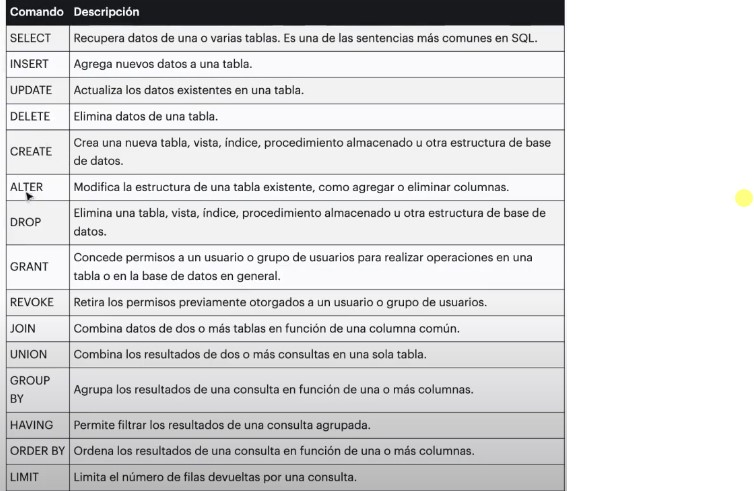
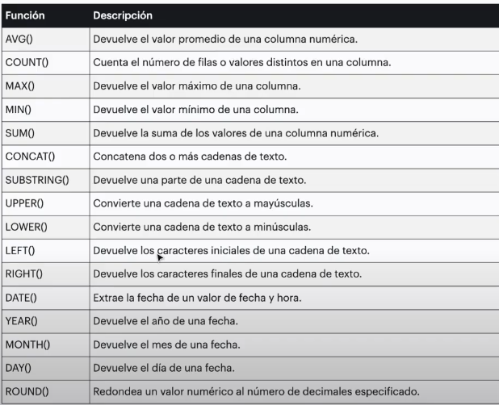

# CURSO SQL 

### Tipos de sentencias SQL 

* Data definition language (DDL): CREATE, ALTER, DROP, TRUNCATE 
* Data manipulation Languaje (DML): SELECT, INSERT, UPDATE, DELETE 
* Data Control Languaje (DCL): GRANT, REVOKE 
* Transaction Control Languaje (TCL): COMMIT, ROLLBACK, SET TRANSACTION

### comandos mas usados 

### funciones mas comunes en sql 

